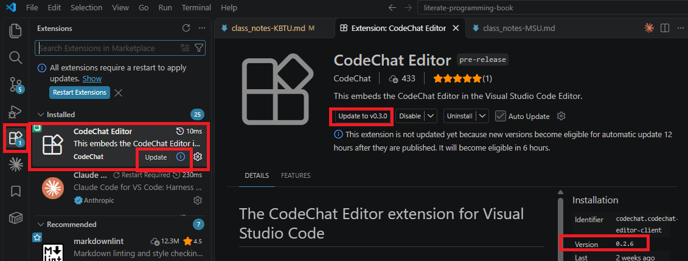

KBTU class notes
================

Week 6: Saturday, 2026-Oct-10
-----------------------------

> "AI can help you express your opinion. It shouldn’t manufacture one for
> you." -- [Brian Jenney](https://spectrum.ieee.org/top-engineering-skills)

1. Attendance is taken online during the first 10 minutes of each class session.
   Mark yourself as present!
2. Homework is due next Friday; see Assignments in the
   [course team](https://teams.cloud.microsoft/l/team/19%3A1zAx6-5JAiMa-lWMwfGS_gCGKl2WS72-A-RtNFHAXkg1%40thread.tacv2/conversations?groupId=4e917b3b-d914-4d2b-807e-c8029802603f&tenantId=57081b5e-e66a-4993-8eaf-15b0b309293f).
3. Questions? Message me on Teams / meet on Teams.
4. Ensure you're running the newly-released CodeChat Editor 0.3.0.
   1. Check and
      update: 
   2. Close the CodeChat Editor if it's open.
   3. Restart extensions.
   4. Open the CodeChat Editor.
5. Enable Capture when using the CodeChat Editor.
6. Articles
   1. [3 Skills That Will Matter More in the Age of AI](https://spectrum.ieee.org/top-engineering-skills)
   2. [Investigating unintended model actions in our evaluations and internal use](https://www.anthropic.com/research/investigating-unintended-model-actions)
7. Dev notes:
   recent [CodeChat Editor](https://github.com/bjones1/CodeChat_Editor)
   features.
   1. Clone this repo.
   2. View the following sections of CodeChat Editor manual (`README.md`):
      1. Cross-references
      2. Gathering fragments
   3. Look at the cache spec under Server / processing.rs section on Cache
      design.
8. CodeChat Editor features: clone [htmd](https://github.com/letmutex/htmd).
   1. Creating a project.
   2. Adding entries to the table of contents.
   3. Adding a unique ID to headings.
   4. Cross-references.
   5. Creating fragments with a unique ID.
   6. Gathering fragments.
9. GitHub use -- collaborative software development
   1. Clone the
      [collaborative class repo](https://github.com/bjones1/literate-programming-github-2026).
   2. See the [GitHub notes](git_intro.md).
10. Developing a specification.

Week 5: Saturday, 2026-Oct-03
-----------------------------

> "Technology and coding are always evolving, so the implementation is not
> nearly as important as the reasoning behind it." - Justin Gray

1. Attendance is taken online during the first 10 minutes of each class session.
   Mark yourself as present!
2. Homework is due next Friday; see Assignments in the
   [course team](https://teams.cloud.microsoft/l/team/19%3A1zAx6-5JAiMa-lWMwfGS_gCGKl2WS72-A-RtNFHAXkg1%40thread.tacv2/conversations?groupId=4e917b3b-d914-4d2b-807e-c8029802603f&tenantId=57081b5e-e66a-4993-8eaf-15b0b309293f).
3. Questions? Message me on Teams / meet on Teams.
4. Github / Git setup:
   1. Create an account on [GitHub](https://github.com/) using your KBTU e-mail.
   2. Add your name and KBTU e-mail to the
      [class list](https://kbtuedu.sharepoint.com/:x:/r/sites/CSDA5101-AdvancedSoftwareParadigms-2026Fall/Shared%20Documents/General/github%20email%20addresses.xlsx?d=w7a632d55de12415abda784409f8fca08&csf=1&web=1&e=t3GYW1).
   3. [Install and configure Git](https://code.visualstudio.com/docs/sourcecontrol/overview#_prerequisites).
   4. Clone the
      [e-book](https://github.com/bjones1/literate-programming-book) -- see
      [Clone repositories](https://code.visualstudio.com/docs/sourcecontrol/repos-remotes#_clone-repositories)
      for step-by-step directions.
5. Enable Capture when using the CodeChat Editor.
6. Articles:
   1. [AI Efficiency Could Cost Us the Next Generation of Experts](https://spectrum.ieee.org/ai-engineer-skills)
   2. [Making io\_uring Actually Fast: I/O Threads, Chunking, and the Memory Story Nobody Talks About](https://www.conviva.ai/resource/making-io_uring-actually-fast-i-o-threads-chunking-and-the-memory-story-nobody-talks-about/);
      see section "Debugging with an LLM in the loop."
7. Dev notes - the
   [CodeChat Editor cache](https://github.com/bjones1/CodeChat_Editor/blob/main/server/src/processing/cache-spec.md).
8. [Introduction to Git](git_intro.md) and GitHub.

Week 4: Saturday, 2026-Sep-26
-----------------------------

> "The idea is that you do not document programs (after the fact), but write
> documents that contain the programs."
> —[John Max Skaller](https://gnosis.cx/publish/programming/charming_python_8.html)

1. Homework is due next Friday; see Assignments in the
   [course team](https://teams.cloud.microsoft/l/team/19%3A1zAx6-5JAiMa-lWMwfGS_gCGKl2WS72-A-RtNFHAXkg1%40thread.tacv2/conversations?groupId=4e917b3b-d914-4d2b-807e-c8029802603f&tenantId=57081b5e-e66a-4993-8eaf-15b0b309293f).
2. Attendance is taken online during the first 10 minutes of each class session.
   Mark yourself as present!
3. Questions? Message me on Teams / meet on Teams.
4. [Resources](README.md).
5. Download the [e-book](https://github.com/bjones1/literate-programming-book).
6. Start using [Capture](http://3.146.138.182/capture-registration/)! Follow the
   [setup guide](course_materials/capture-token-setup-guide-KBTU.html). Use a
   class code of `ECE9990`.
7. Articles:
   1. [AI coding article](https://spectrum.ieee.org/ai-code-review-software-engineers) -
      spec writing is central. See "AI Agents in Code Review Workflows" section.
   2. [AI Efficiency Could Cost Us the Next Generation of Experts](https://spectrum.ieee.org/ai-engineer-skills)
8. Dev notes - [htmd](https://github.com/letmutex/htmd/pull/78),
   review/implementation in htmd.
9. [Writing tests](exercises/spec-design.md) to accompany a specification.
10. The [origins of literate programming](origins.md).

Week 3: Saturday, 2026-Sep-19
-----------------------------

> "The model's job is to produce something plausible. Your job is to make sure
> only one thing is plausible." -- Claude

1. Homework is due next Friday; see Assignments in the
   [course team](https://teams.cloud.microsoft/l/team/19%3A1zAx6-5JAiMa-lWMwfGS_gCGKl2WS72-A-RtNFHAXkg1%40thread.tacv2/conversations?groupId=4e917b3b-d914-4d2b-807e-c8029802603f&tenantId=57081b5e-e66a-4993-8eaf-15b0b309293f).
2. Questions? Message me on Teams / meet on Teams.
3. [Resources](README.md).
4. Download the [e-book](https://github.com/bjones1/literate-programming-book).
5. Review: [what your prompt didn't say](exercises/spec-quality/handout.md).
6. Question: "What if we just ask another LLM to answer these question and by
   using this script ask our initial LLM, what is the productivity of it?"
7. [AI Efficiency Could Cost Us the Next Generation of Experts](https://spectrum.ieee.org/ai-engineer-skills)
8. [OpenAI – Hugging Face Incident Technical Report](https://cdn.openai.com/pdf/67869394-cb91-4c12-888c-5cbd85c7814c/OpenAI-Hugging-Face%20Incident-Technical-Report.pdf)
9. Introduction to the CodeChat Editor. Become familiar with
   [CommonMark](https://commonmark.org/help/), which is used by the CodeChat
   Editor to format comments. The CodeChat Editor also supports many
   [GitHub extensions](https://docs.github.com/en/get-started/writing-on-github/getting-started-with-writing-and-formatting-on-github/basic-writing-and-formatting-syntax)
   to CommonMark.
10. [Writing a spec and tests](exercises/spec-design.md).

Week 1: Monday, 2026-Sep-07
---------------------------

1. Introductions.
2. Syllabus review.
3. What your prompt didn't say.

### In-class exercises

1. A screenshot
