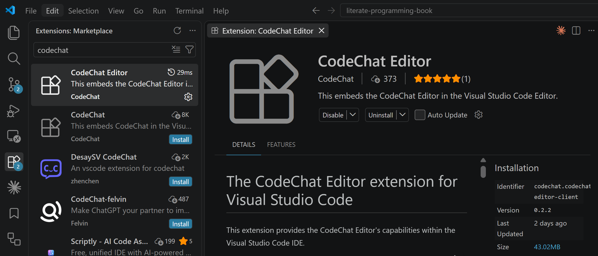

Class notes
===========

Wednesday, 2026-Sep-02
----------------------

> The idea is that you do not document programs (after the fact), but write
> documents that contain the programs.

1. Questions? [Schedule a meeting](https://bjones.youcanbook.me).

2. [Homework](https://canvas.msstate.edu/courses/186065/assignments) - due
   Sunday!

3. CodeChat Editor update -- verify you have v0.2.2!

   

4. Start using Capture! Follow the <a href="course_materials/capture-token-setup-guide.html" target="_blank" rel="noopener noreferrer">setup guide</a> then message me on Teams.

5. Today's topic: the [origins of literate programming](origins.md).

Monday, 2026-Aug-31
-------------------

1. [Resources](README.md)
2. Questions? [Schedule a meeting](https://bjones.youcanbook.me).
3. [Homework](https://canvas.msstate.edu/courses/186065/assignments) - due
   Sunday!
4. Updated class schedule (see table of contents).
5. Quote:
   > "The model's job is to produce something plausible. Your job is to make
   > sure only one thing is plausible."
6. Writing must be specific.
7. Always employ LLM review (code, specs, etc.).
8. Keep specs close to code (literate programming, using the CodeChat Editor).
9. Drive LLMs from specs in code/docs, not from prompts.
10. Ensure cognitive engagement.
11. Today's topic: the [origins of literate programming](origins.md).

Friday, 2026-Aug-28
-------------------

1. CodeChat Editor Capture
2. Today's topic: write tests.
