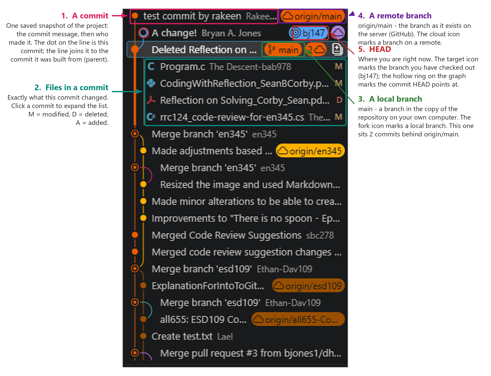
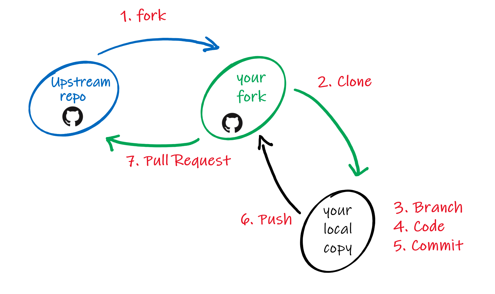

Introduction to Git
===================

If you don't have an account on [GitHub](https://github.com/), create one. Send
me your GitHub userid. Then, fork and clone the
[e-book](https://github.com/bjones1/literate-programming-book) -- see
[Forking and cloning with the VSCode Git GUI](#forking-and-cloning-with-the-vscode-git-gui)
for step-by-step directions.

Summary
-------

A Git repository tracks changes to files over time in discrete units called
commits.[1](#fGU2e6HP9t)

* The staging area (or index) selects which changes to files to store in a
  commit.
* A commit records these changes to a group of files to the local repository (or
  repo). It's a snapshot of your files.
* A repository is a graph of commits; they can be local or remote.
* A branch refers to a commit and all its children in the repository.
* The head refers to the currently active commit.

Local actions:

* Stage changes to files to the staging area/index, or discard mistakes.
* Commit them to the local repository.
* Add a branch; merge a branch into another; delete a branch.
* Check out a branch or a commit, which updates files and the head.

Remote actions:

* Clone (copy) commits a remote repo to a new local repo.
* Push commits from the local repo to a remote repo.
* Fetch commits from the remote repo to the local repo (opposite of push).

Practice:

* Clone
  [https://github.com/bjones1/literate-programming-fall-2024](https://github.com/bjones1/literate-programming-fall-2024).
* Browse to
  [https://github.com/bjones1/literate-programming-github-fall-2026](https://github.com/bjones1/literate-programming-github-fall-2026).

Lots of resources online! A [tutorial](https://learngitbranching.js.org), many
videos.

### Footnotes

1. Prompt to used create this image:

   > The image @course\_materials/git\_graph.png shows a screenshot of the
   > VSCode Git GUI. Add annotations to this image to show:
   >
   > 1. A commit
   > 2. Files in a commit.
   > 3. A local branch.
   > 4. A remote branch.
   > 5. The HEAD.

Forking and cloning with the VSCode Git GUI
-------------------------------------------

This section was written by Claude, with edits by
[bjones1](https://github.com/bjones1/).[2](#fKz9Qm4Xr2)

This is the [first two steps](https://herbmiller.me/learning-a-pr-process/) of
the standard method for open-source software development; from last week, you're
familiar with steps 3-6 as well:

<figure>
  
  <figcaption>
    Open-source workflow, adapted from <a href="https://herbmiller.me/learning-a-pr-process/">Herb Miller</a>.
  </figcaption>
</figure>

A **fork** is your own copy, on GitHub, of someone else's repo. You may push to
your fork, but not to the repo you forked from (the **upstream** repo); to get
your work back to the upstream repo, you'll open a pull request. A **clone** is
a copy of a repo on your computer, where you'll actually do the work. So, the
usual sequence is: fork on GitHub, then clone your fork to your computer.

### 1\. Sign in to GitHub from VSCode

Click the Accounts icon (the person at the bottom of the Activity Bar on the far
left of the window), then **Sign in with GitHub**. VSCode opens a browser
window; approve the request there, then let the browser hand you back to VSCode.
If you skip this step, VSCode will ask you to sign in the first time it needs
GitHub, which works just as well.

### 2\. Fork the repo

Forking happens on GitHub's servers, so this step is done in the browser:

1. Browse to the repo, e.g.
   [https://github.com/bjones1/literate-programming-github-fall-2026](https://github.com/bjones1/literate-programming-github-fall-2026).
2. Click **Fork** near the top right of the page, then **Create fork**. The
   defaults are fine.
3. GitHub takes you to your copy, at
   `https://github.com/`*your-userid*`/literate-programming-github-fall-2026`.
   The heading says "forked from bjones1/literate-programming-book" -- check for
   this, since it's how you know you're looking at your fork instead of the
   original.

### 3\. Clone your fork

Back in VSCode, with no folder open (**File > Close Folder** if necessary):

1. Open the Source Control view (the branch icon in the Activity Bar, or
   <kbd>Ctrl+Shift+G</kbd>), then click **Clone Repository**. Equivalently,
   press <kbd>Ctrl+Shift+P</kbd> (<kbd>Cmd+Shift+P</kbd> on a Mac) to open the
   Command Palette and run **Git: Clone**.
2. Choose **Clone from GitHub**, then type
   *your-userid*`/literate-programming-github-fall-2026` and pick your fork from
   the list. Alternatively, paste the URL copied from the green **Code** button
   on your fork's GitHub page.
3. Pick the folder that will *contain* your clone; VSCode creates a subfolder
   named after the repo inside it. Avoid folders synced by OneDrive, Dropbox,
   etc., which corrupt repos.
4. When VSCode asks "Would you like to open the cloned repository?", click
   **Open**.

You now have a working repo: the status bar at the bottom left shows the current
branch (`main`) and a sync icon, and the Source Control view shows your changes
as you edit files.

Cloning also saves the address it cloned from, so you don't have to retype it
every time you push or fetch. A saved address like this is called a **remote**,
and Git names this first one `origin` by convention -- it's just a nickname for
`https://github.com/`*your-userid*`/literate-programming-github-fall-2026.git`.
Since you cloned your fork, `origin` *is* your fork: it's where **Sync Changes**
sends your commits, and it's the one remote you have permission to push to.

### 4\. Add the upstream repo as a remote

Your fork is a snapshot; it doesn't update itself when I add material. Teach
your clone about the upstream repo so you can pull class updates:

1. Command Palette > **Git: Add Remote...**
2. Name it `upstream`, and give it the URL of the repo you forked:
   `https://github.com/bjones1/literate-programming-github-fall-2026`.

Your clone now has two remotes: `origin` (your fork, which you can push to) and
`upstream` (mine, which you can only read).

To pick up class changes later, first check that you're on the `main` branch: the
status bar at the bottom left names the branch you're on, and clicking it lets
you switch. A merge lands in whatever branch you're standing on, so if the
status bar says anything but `main`, switch before you go on. Then: Command
Palette > **Git: Fetch From All Remotes**, followed by **Git: Merge...**, and
choose `upstream/main`. Push the result to your fork with **Sync Changes** in
the Source Control view.

### If you cloned the upstream repo by mistake

Cloning my repo directly works fine until you try to push, at which point GitHub
refuses -- you don't have write access. VSCode notices and offers to create a
fork for you. Click **Create Fork**; VSCode creates the fork on GitHub, adds it
to your clone as a remote, and pushes your branch there. Check the result under
the Source Control view's **...** menu > **Remote**, which lists the remotes
your clone knows about.

### Footnotes

2. Claude (Claude Opus 5, run from Claude Code) wrote
   this section, from the prompt:

   > Add a section to @git\_intro.md that shows students how to use the VSCode
   > Git GUI to fork and clone a github repository.
